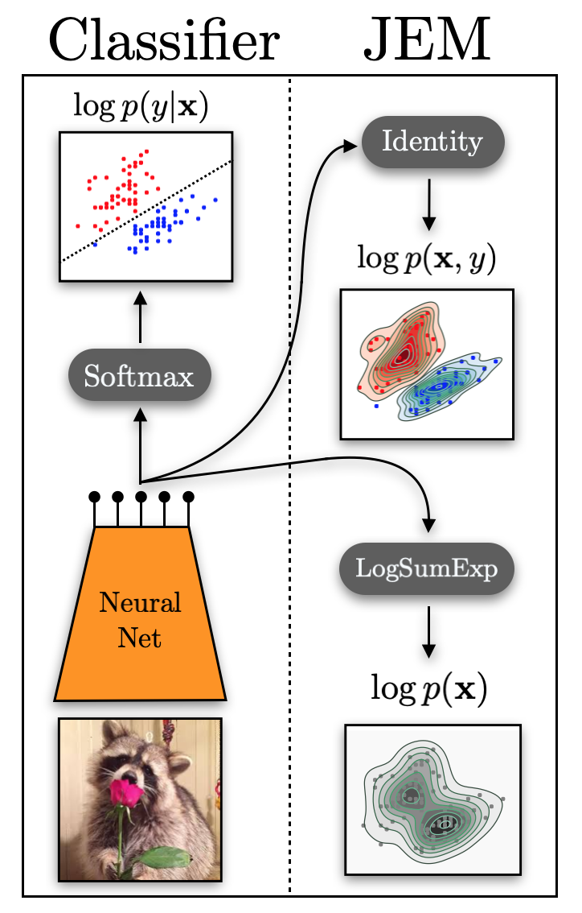

# JEM - Joint Energy Models

Official code for the paper [Your Classifier is Secretly an Energy Based Model and You Should Treat it Like One](https://arxiv.org/abs/1912.03263).



Includes scripts for training JEM (Joint-Energy Model), evaluating models at various tasks, and running adversarial attacks.

A pretrained model on CIFAR10 can be found [here](http://www.cs.toronto.edu/~wgrathwohl/CIFAR10_MODEL.pt).

For more info on me and my work please checkout my [website](http://www.cs.toronto.edu/~wgrathwohl/), [twitter](https://twitter.com/wgrathwohl), or [Google Scholar](https://scholar.google.ca/citations?user=ZbClz98AAAAJ&hl=en). 

Many thanks to my amazing co-authors: [Jackson (Kuan-Chieh) Wang](https://twitter.com/kcjacksonwang), [Jörn-Henrick Jacobsen](https://jhjacobsen.github.io/), [David Duvenaud](http://www.cs.toronto.edu/~duvenaud/), [Mohammad Norouzi](https://norouzi.github.io/), and [Kevin Swersky](https://ai.google/research/people/105739). 


## Usage
### Training
To train a model on CIFAR10 as in the paper
```markdown
python train_wrn_ebm.py --lr .0001 --dataset cifar10 --optimizer adam --p_x_weight 1.0 --p_y_given_x_weight 1.0 --p_x_y_weight 0.0 --sigma .03 --width 10 --depth 28 --save_dir /YOUR/SAVE/DIR --plot_uncond --warmup_iters 1000
```

### Evaluation

To evaluate the classifier (on CIFAR10):
```markdown
python eval_wrn_ebm.py --load_path /PATH/TO/YOUR/MODEL.pt --eval test_clf --dataset cifar_test
```
To do OOD detection (on CIFAR100)
```markdown
python eval_wrn_ebm.py --load_path /PATH/TO/YOUR/MODEL.pt --eval OOD --ood_dataset cifar_100
```
To generate a histogram of OOD scores like Table 2
```markdown
python eval_wrn_ebm.py --load_path /PATH/TO/YOUR/MODEL.pt --eval logp_hist --datasets cifar10 svhn --save_dir /YOUR/HIST/FOLDER
```
To generate new unconditional samples
```markdown
python eval_wrn_ebm.py --load_path /PATH/TO/YOUR/MODEL.pt --eval uncond_samples --save_dir /YOUR/SAVE/DIR --n_sample_steps {THE_MORE_THE_BETTER (1000 minimum)} --buffer_size 10000 --n_steps 40 --print_every 100 --reinit_freq 0.05
```
To generate conditional samples from a saved replay buffer
```markdown
python eval_wrn_ebm.py --load_path /PATH/TO/YOUR/MODEL.pt --eval cond_samples --save_dir /YOUR/SAVE/DIR
```
To generate new conditional samples
```markdown
python eval_wrn_ebm.py --load_path /PATH/TO/YOUR/MODEL.pt --eval cond_samples --save_dir /YOUR/SAVE/DIR --n_sample_steps {THE_MORE_THE_BETTER (1000 minimum)} --buffer_size 10000 --n_steps 40 --print_every 10 --reinit_freq 0.05 --fresh_samples
 ```


### Attacks

To run Linf attacks on JEM-1
```markdown
python attack_model.py --start_batch 0 --end_batch 6 --load_path /PATH/TO/YOUR/MODEL.pt --exp_name /YOUR/EXP/NAME --n_steps_refine 1 --distance Linf --random_init --n_dup_chains 5 --base_dir /PATH/TO/YOUR/EXPERIMENTS/DIRECTORY
```
To run L2 attacks on JEM-1
```markdown
python attack_model.py --start_batch 0 --end_batch 6 --load_path /cloud_storage/BEST_EBM.pt --exp_name rerun_ebm_1_step_5_dup_l2_no_sigma_REDO --n_steps_refine 1 --distance L2 --random_init --n_dup_chains 5 --sigma 0.0 --base_dir /cloud_storage/adv_results &
 ```
 

Happy Energy-Based Modeling! 
