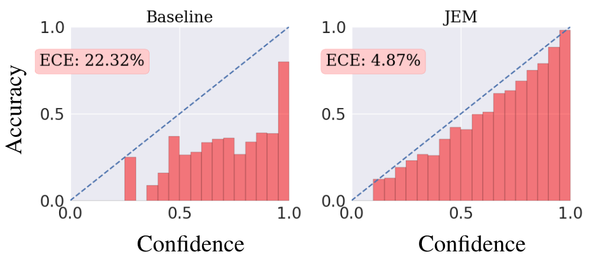
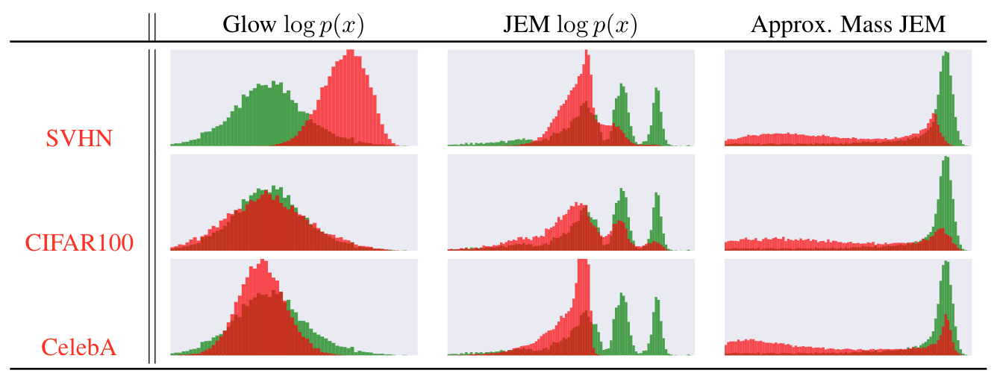
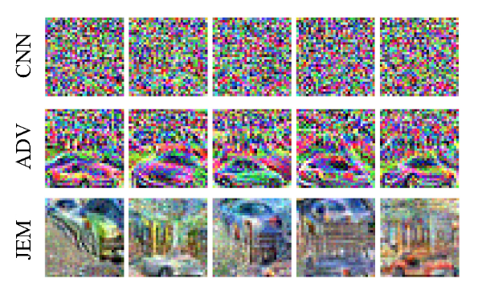

# JEM - Joint Energy Models

Code for the paper [Your Classifier is Secretly an Energy Based Model and You Should Treat it Like One](https://arxiv.org/abs/1912.03263).

Includes scripts for training JEM (Joint-Energy Model), evaluating models at various tasks, and running adversarial attacks.

A pretrained model on CIFAR10 can be found [here](http://www.cs.toronto.edu/~wgrathwohl/CIFAR10_MODEL.pt).


## Usage
### Training
To train a model on CIFAR10 as in the paper
```markdown
python train_wrn_ebm.py --lr .0001 --optimizer adam --p_x_weight 1.0 --p_y_given_x_weight 1.0 --p_x_y_weight 0.0 --sigma .03 --width 10 --depth 28 --save_dir /YOUR/SAVE/DIR --plot_uncond --warmup_iters 1000
```

### Evaluation

To evaluate the classifier (on CIFAR10):
```markdown
python eval_wrn_ebm.py --load_path /PATH/TO/YOUR/MODEL.pt --eval test_clf --dataset cifar_test
```
To do OOD detection (on CIFAR100)
```markdown
python eval_wrn_ebm.py --load_path /PATH/TO/YOUR/MODEL.pt --eval OOD --ood_dataset cifar_100
```
To generate a histogram of OOD scores like Table 2
```markdown
python eval_wrn_ebm.py --load_path /PATH/TO/YOUR/MODEL.pt --eval logp_hist --datasets cifar10 svhn --save_dir /YOUR/HIST/FOLDER
```
To generate new unconditional samples
```markdown
python eval_wrn_ebm.py --load_path /PATH/TO/YOUR/MODEL.pt --eval uncond_samples --save_dir /YOUR/SAVE/DIR --n_sample_steps {THE_MORE_THE_BETTER (1000 minimum)} --buffer_size 10000 --n_steps 40 --print_every 100 --reinit_freq 0.05
```
To generate conditional samples from a saved replay buffer
```markdown
python eval_wrn_ebm.py --load_path /PATH/TO/YOUR/MODEL.pt --eval cond_samples --save_dir /YOUR/SAVE/DIR
```
To generate new conditional samples
```markdown
python eval_wrn_ebm.py --load_path /PATH/TO/YOUR/MODEL.pt --eval cond_samples --save_dir /YOUR/SAVE/DIR --n_sample_steps {THE_MORE_THE_BETTER (1000 minimum)} --buffer_size 10000 --n_steps 40 --print_every 10 --reinit_freq 0.05 --fresh_samples
  ```
 


### Markdown

Markdown is a lightweight and easy-to-use syntax for styling your writing. It includes conventions for

```markdown
Syntax highlighted code block

# Header 1
## Header 2
### Header 3

- Bulleted
- List

1. Numbered
2. List

**Bold** and _Italic_ and `Code` text

[Link](url) and 
```

For more details see [GitHub Flavored Markdown](https://guides.github.com/features/mastering-markdown/).

### Jekyll Themes

Your Pages site will use the layout and styles from the Jekyll theme you have selected in your [repository settings](https://github.com/wgrathwohl/JEM/settings). The name of this theme is saved in the Jekyll `_config.yml` configuration file.

### Support or Contact

Having trouble with Pages? Check out our [documentation](https://help.github.com/categories/github-pages-basics/) or [contact support](https://github.com/contact) and we’ll help you sort it out.


We show that architectures traditionally used for classification can be reinterpreted as energy based models of the joint distribution over data and labels p(x, y). 

Training models in this way has many benifits including:

### Improved calibration


### Out-Of-Distribution Detection


### Adversarial Robustness

